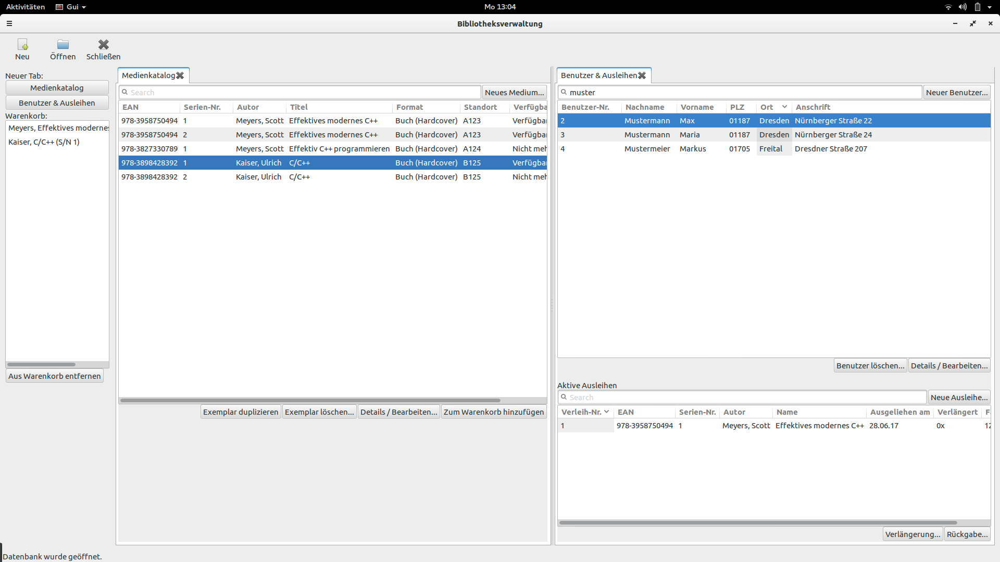

Lucas Hinderberger, HTW Dresden, summer term 2017

# Beleg Programmierung 2



The source code documentation for this program is written in English.
For more details on the development of this exam, read the german readme file `README.de`.

#### Copyright + Third Party Libraries
The rules apply as written in the German README.de - below is just a summary!

This program was created by Lucas Hinderberger in the summer term of 2017 at
HTW Dresden for purely educational purposes and isn't intended to be used in any
commercial, industrial or other real-life environment. Do not distribute this software!

This program links against and might include code of the following third-party libraries:

- wxWidgets (LGPL, https://wxwidgets.org)
- SQLite (Public Domain, https://sqlite.org)

Only for Testing, this also needs to be installed:
- Google Test (3-Clause-BSD, https://github.com/google/googletest)

## Structure
```
\prog2-beleg
|--doc     - Contains UML + Screen design files as well as screen shots / renderings for
             those without access to UML / Screen Design tools.
|--include - Contains public and private include files for the core library + GUI.
|--src     - Contains source files for the included modules.
|--tests   - Contains test cases that can also be called using the `test` make target.
|
|-CMakeLists.txt - Use this file to build the project using CMake
```

## How to build
Simply type `cmake .` followed by `make gui` to build the GUI and run `./bin/gui` to
execute the program.

To execute all tests, run `make test`. You should see an evaluation of all test cases
returned to you. Be advised that for this you need to have the Google Test development
libraries installed!

Note: `make` / `make all` will also build the test target so it might fail if you don't
have Google Test installed. However `make gui` and `make core` should work fine without
testing dependencies installed.